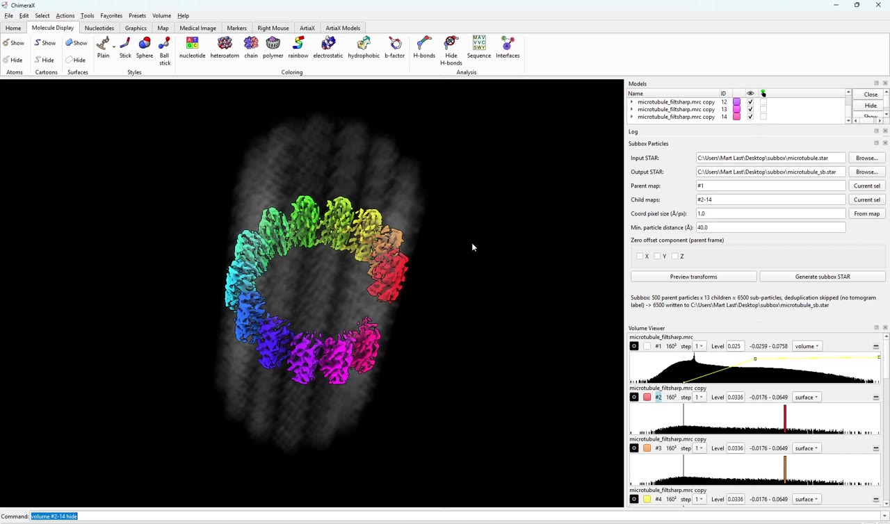
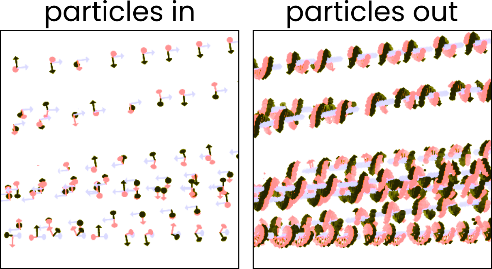
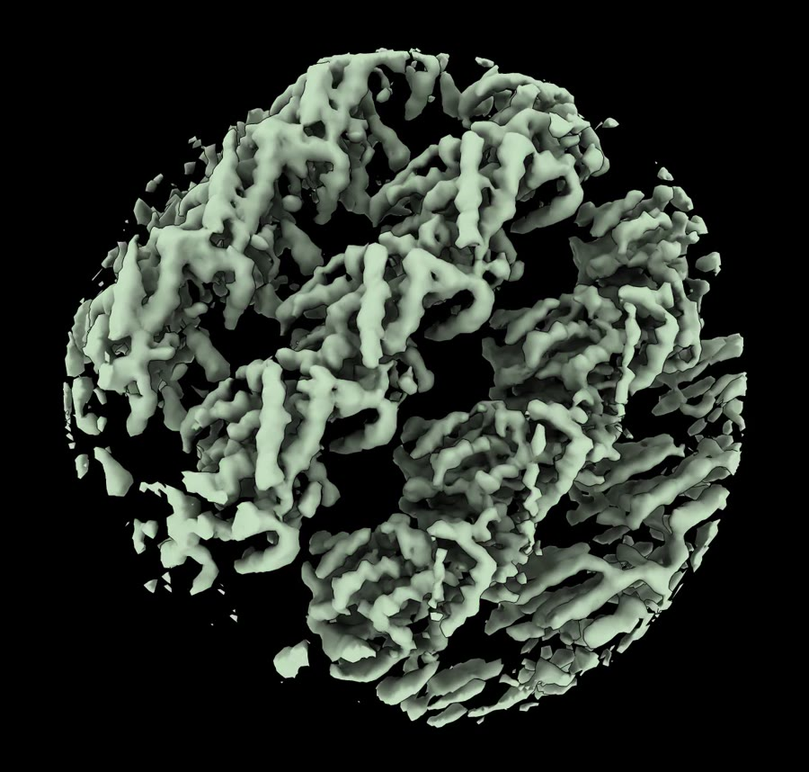

Inspired by Alister Burt's
[napari-subboxer](https://github.com/alisterburt/napari-subboxer).

Subboxing for ChimeraX: turn particles of a complex into particles of its
subunits. Works with RELION and Warp/M star files.

<p align="center">
  <a href="docs/demo.mp4"></a>
</p>

<p align="center">
  
</p>

<p align="center">
  <a href="docs/morph.mp4"></a>
</p>
<p align="center"><em>Turn nice map into much nicer map by subboxing your
symmetry!</em></p>

## Install

Download
[ChimeraX_Subbox-1.1-py3-none-any.whl](https://github.com/mgflast/ChimeraX-subbox/raw/main/dist/ChimeraX_Subbox-1.1-py3-none-any.whl)
and, in ChimeraX:

```
toolshed install /path/to/ChimeraX_Subbox-1.1-py3-none-any.whl
```

Then open it via `Tools ▸ Volume Data ▸ Subbox Particles`.

## How it works

1. Open your map.
2. Crop out a monomer.
3. Place duplicates of that monomer onto the corresponding positions in the
   parent map.
4. Point at a star file and press go.

Subbox finds the transform of each monomer relative to the parent map, then for
every particle in the input star file writes one output particle per monomer.
Offsets are measured between the intensity-weighted centres of mass of the
maps, so keep the parent and the monomer at the same contour level.

## Zeroing offset components

Each monomer's offset from the parent can be zeroed per axis, which decides
whether the output particles stay centred on the complex or move onto the
subunit. For a microtubule with the filament axis along Z:

* **zero X and Y** — the particles are still microtubule segments, just shifted
  along Z and rotated about the tube axis.
* **don't zero them** — the particles are now centred on a protofilament.
  Depending on what you feed them into next, you may need to make a new mask.

## Deduplication

Optional: set a distance threshold D, and of any pair of particles within D of
each other, one is removed. Per tomogram.

MIT licensed.
